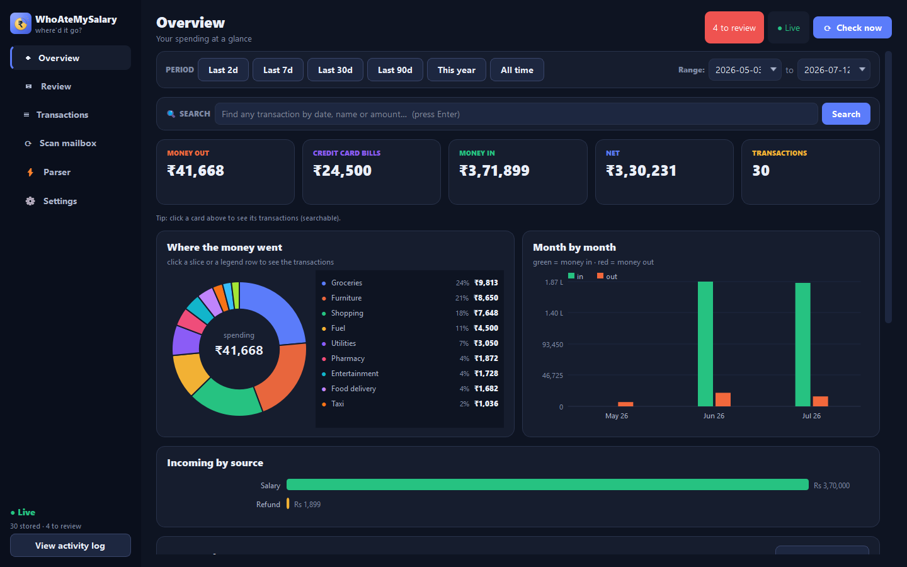
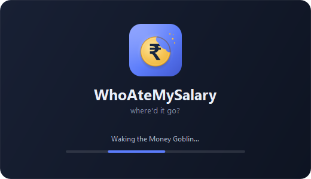
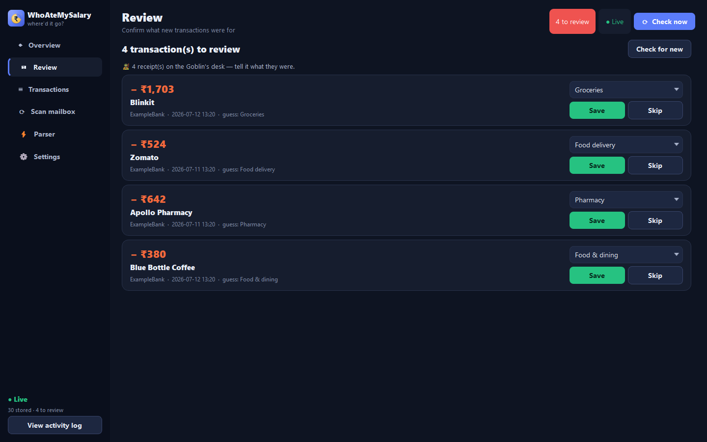
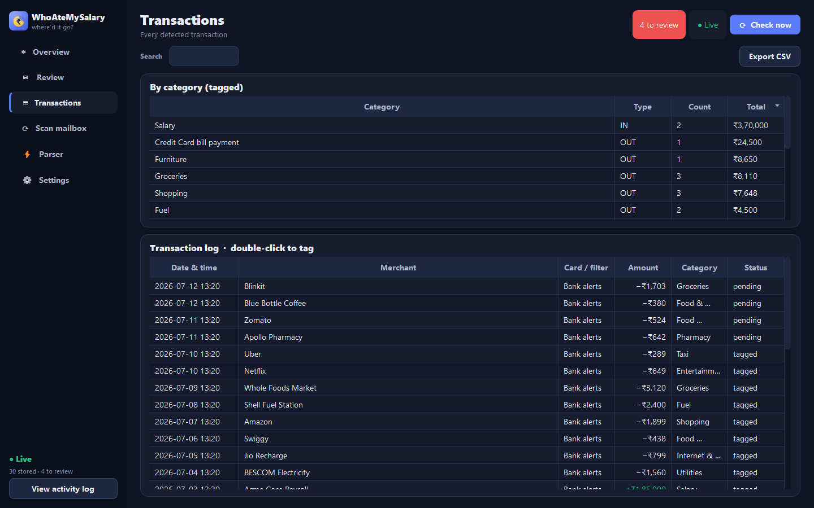
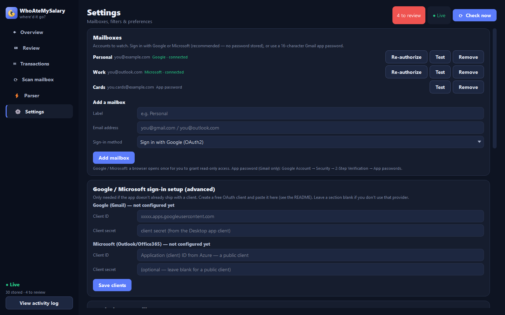

<p align="center">
  
</p>

# WhoAteMySalary

**See exactly where your salary went — a private, local spending dashboard built from the bank
transaction-alert emails you already get. Free, and all you need is one Gmail.**

[](LICENSE)
[](https://www.python.org/downloads/release/python-3120/)
[](#download--install)
[](https://github.com/hterminal/WhoAteMySalary/releases)

WhoAteMySalary is a native **PyQt5** desktop app. It connects to your Gmail or Outlook
over **read-only IMAP**, finds the "you spent ₹…" / "you received ₹…" alert emails your banks
already send you, parses out the amount, direction and merchant, pops a Windows desktop
notification, and lets you categorise and analyse where your money goes. It's **free**, works
with **just one Gmail account**, and everything stays **on your machine** — you stay in control
of your data.

## Why you'll like it

- 💸 **Free, forever.** No subscription, no server bills, no ads — it runs entirely on your
  own computer.
- 📬 **One Gmail is all you need.** No new account to create, no bank login, no third-party
  aggregator to trust — it just reads the transaction-alert emails your bank already sends.
- 🔒 **You control your data.** Your transactions, settings and tokens never leave your
  machine; the app makes only **read-only** IMAP connections and uploads nothing, anywhere.
- 🎛️ **Track it your way.** Your own categories, filters and parser rules — bend it to how
  *you* think about money.
- 🖥️ **Runs everywhere.** Windows, macOS and Linux, from a single download.
- 🧌 **Meet the Money Goblin** — the little gremlin that ate your salary now owns up to it,
  announcing every new transaction and (charmingly) nagging you to categorise it.



---

## Features

- **Reads the emails you already get.** No screen-scraping, no bank credentials, no
  third-party aggregator. Just the transaction alerts your bank emails you.
- **Three sign-in methods** — a [Gmail app password](#use-a-gmail-app-password) (✅ **tested**),
  or browser-based OAuth2 for [Google](#sign-in-with-google-oauth2) or
  [Microsoft / Outlook](#sign-in-with-microsoft-outlook) (⚠️ **not yet verified end-to-end**) —
  none of which store your password.
- **Smart parser** that pulls the amount + currency out of messy alert text while
  deliberately ignoring "available balance" and "credit limit" figures, detects the
  direction (money in vs money out), and extracts the merchant, card (e.g. `XX1009`) and bank.
- **Multi-currency aware** — understands ₹/INR, `$`/USD, `£`, `€`, and more, and flags
  foreign-currency transactions.
- **Automatic categorisation** with a broad, India-friendly category set (Groceries, Food
  delivery, Fuel, Subscriptions, EMIs, and dozens more), plus **merchant memory** so a
  payee keeps the category you last chose.
- **Credit-card bills done right.** A credit-card *bill payment* is neither income nor
  spend (the individual card purchases are already counted), so it gets its own bucket and
  is never double-counted.
- **Interactive dashboard** — KPI cards, an interactive donut you can click to drill in,
  month-by-month bars, incoming-by-source, an expandable merchant tree, and highlighted
  large transactions.
- **Review queue** — every newly detected transaction appears for a quick verify /
  categorise / skip, with a desktop notification.
- **The Money Goblin** — a playful mascot announces each new transaction ("🧌 The Money
  Goblin sniffed out a new receipt") and reminds you what still needs a category.
- **Desktop notifications** on Windows (Action Center, with sound) via `windows-toasts`,
  degrading gracefully to `winotify` → `plyer` → console. A **Send test notification**
  button lets you confirm alerts work.
- **Parser page** with a paste-an-email tester that explains exactly what it extracted and
  why, plus custom keyword/merchant rules you can add yourself.
- **Fully local & private** — read-only IMAP only; your config, tokens and databases never
  leave your computer.

---

## Screenshots

**Startup** — a splash screen while the app boots:

<p align="center">
  
</p>

**Review queue** — verify and categorise each new transaction as it arrives:



**Transactions** — a sortable, searchable table you can tag and export to CSV:



**Settings** — mailboxes, tracked sources, notifications, and Google sign-in setup:



There is also a **Parser** page (`docs/screenshots/parser.png`) where you can paste any
alert email and watch the 4-step pipeline explain its decision.

> The screenshots use fabricated demo data (`you@example.com`) — no real accounts.

---

## Download & Install

Grab the latest build for your OS from the
[**Releases**](https://github.com/hterminal/WhoAteMySalary/releases) page.

Each release attaches a ready-to-run bundle per OS (built automatically by CI — see
[Building releases](#building-releases)).

### Windows
Download **`WhoAteMySalary-windows.zip`**, unzip it anywhere, and run **`WhoAteMySalary.exe`**.
Windows SmartScreen may warn about an unrecognised publisher on first launch — click
**More info → Run anyway**.

### macOS
Download **`WhoAteMySalary-macos.zip`**, unzip it, and move **`WhoAteMySalary.app`** to
**Applications**. Because the build isn't notarised, the first launch is blocked by
Gatekeeper — **right-click (or Control-click) the app → Open**, then confirm. Once only.

### Linux
Download **`WhoAteMySalary-linux.tar.gz`**, extract it, and run the launcher:

```bash
tar -xzf WhoAteMySalary-linux.tar.gz
./WhoAteMySalary/WhoAteMySalary
```

### Run from source

Requires **Python 3.12** (PyQt5 has no wheels for the 3.15 alpha).

```bash
# clone your repo
git clone https://github.com/hterminal/WhoAteMySalary.git
cd WhoAteMySalary

# install dependencies
py -3.12 -m pip install -r requirements.txt

# run
py -3.12 app.py
```

On Windows you can also just double-click **`run_pyqt.bat`** (it installs PyQt5 on first
run), or **`start_pyqt_hidden.vbs`** to launch with no console window.

---

## Configuration

On first run the app creates a local `config.json` with sensible defaults; a shipped
[`config.example.json`](config.example.json) is included as a reference template. You can
add mailboxes and tune settings entirely from the **Settings** page — you don't need to
hand-edit JSON.

Each mailbox needs **one** of the three sign-in methods below.

> **Sign-in status.** The **Gmail app password** method is ✅ **tested and working**
> end-to-end. The **Google OAuth2** and **Microsoft OAuth2** methods are ⚠️ **implemented but
> not yet verified end-to-end** — if you try them, feedback (and PRs) are very welcome.

### Sign in with Google (OAuth2)

> ⚠️ **Not yet tested.** This flow is fully implemented but has not been verified end-to-end
> against a live Google account. For a known-working setup today, use a
> [Gmail app password](#use-a-gmail-app-password).

The browser-based OAuth2 flow: you grant access in your browser and the app stores only a
refresh token in `tokens.json` — **your password is never entered or stored.**

If your copy of the app already ships with a Google client (see
[Ship your own OAuth client(s)](#ship-your-own-oauth-clients)), just open **Settings**, click
**Sign in with Google (OAuth2)** on the mailbox, and complete the browser prompt.

If it doesn't, you'll need a free Google Cloud OAuth **Desktop app** client (about 3
minutes):

1. Go to the [Google Cloud Console](https://console.cloud.google.com/) and **create a
   project** (or pick an existing one).
2. **Enable the Gmail API** for that project (APIs & Services → Library → Gmail API → Enable).
3. **Configure the OAuth consent screen**: User type **External**; fill in the app name and
   your email. Under **Test users**, add the Google account(s) you'll sign in with.
4. **Create credentials**: APIs & Services → Credentials → **Create Credentials → OAuth
   client ID** → Application type **Desktop app**. Copy the **Client ID** and **Client
   secret**.
5. In the app, open **Settings → Google sign-in setup (advanced)** and paste the Client ID
   and secret, then save. Now click **Sign in with Google (OAuth2)** on your mailbox.

> **Restricted-scope caveat.** WhoAteMySalary uses Gmail's `https://mail.google.com/`
> scope, which Google classifies as a **restricted scope**. An **unverified** app only
> works for accounts you added as **Test users** (up to 100), which is perfectly fine for
> personal / family / small use. Distributing to the general public would require going
> through Google's app verification (and possibly a CASA security assessment).

### Sign in with Microsoft (Outlook)

> ⚠️ **Not yet tested.** This flow is fully implemented but has not been verified end-to-end
> against a live Microsoft account. If your Outlook account can't use an app password, this is
> your only option — please report back how it goes.

For **Outlook.com / Hotmail / Live / Office 365** mailboxes, use Microsoft OAuth2. (Microsoft
has disabled app passwords / basic auth for most accounts, so OAuth is the way in.) As with
Google, you grant access in your browser and only a refresh token is stored — no password.

If your copy ships with a Microsoft client, just pick **Sign in with Microsoft / Outlook
(OAuth2)** on the mailbox and complete the prompt. Otherwise register a free client (a few
minutes):

1. Go to the [Azure Portal](https://portal.azure.com/) → **Microsoft Entra ID** (Azure AD) →
   **App registrations** → **New registration**.
2. Name it. Under **Supported account types** choose **Accounts in any organizational
   directory and personal Microsoft accounts** so personal Outlook accounts work.
3. Under **Redirect URI**, pick platform **Mobile and desktop applications** and add
   **`http://localhost`**. This makes it a **public client** — no client secret needed.
4. Click **Register** and copy the **Application (client) ID**.
5. In the app, open **Settings → Google / Microsoft sign-in setup (advanced)**, paste the ID
   into the **Microsoft** section (leave the secret blank), and save. Then click **Sign in
   with Microsoft / Outlook (OAuth2)** on your mailbox.

> The app requests the read-only `IMAP.AccessAsUser.All` scope and connects to
> `outlook.office365.com`. As with Google, an unverified app works for accounts you allow;
> broad public distribution or some work/school tenants may require admin consent or app
> verification.

### Use a Gmail app password

> ✅ **Tested and working.** This is the sign-in method verified end-to-end — the
> recommended choice today.

If you'd rather not set up OAuth, use a 16-character Gmail **app password**:

1. Enable **2-Step Verification** on your Google account.
2. Go to **Google Account → Security → 2-Step Verification → App passwords** and generate
   a password (choose "Mail" / "Other").
3. In the app, open **Settings**, set the mailbox's method to **App password**, and paste
   the 16-character password.

App passwords are stored in your local `config.json` (git-ignored). OAuth is recommended
because nothing reusable is stored in plaintext.

### Tracked sources / filters

By default the app can track any email that looks like a transaction (the global
**catch-all** toggle, `track_all_amount_emails`). For precision, define **sources** in
Settings — each source matches on the sender (`from_contains`) and/or the subject
(`subject_contains`), with a match mode (`both` / `from` / `subject` / `either`). You can
also list **ignore senders** to always skip. The bundled defaults include Canara Bank,
PNB and CRED as examples.

---

## Log expenses by voice (Siri + Apple Shortcut)

On iPhone / iPad / Mac you can log a cash or UPI spend **hands-free**. Build a small Apple
Shortcut that emails *yourself* a bank-style alert, and WhoAteMySalary files it like any real
transaction — so you can add expenses with Siri:

> "Hey Siri, **Log an Expense**" → *"What is the amount?"* → *"What's it for?"* → 🧌 it lands
> in **Review**.

Full step-by-step (with screenshots): **[docs/APPLE_SHORTCUT.md](docs/APPLE_SHORTCUT.md)**.

<p>
  
  
</p>

---

## How it works

For every candidate email, the parser runs a 4-step pipeline (visible and testable on the
**Parser** page):

1. **Match** — check the sender and subject against your tracked sources (and ignore list)
   to decide whether the email should be considered at all.
2. **Extract the amount** — pull the amount and currency, preferring the figure tied to the
   transaction phrase or a debit/credit verb, and **skipping** "available balance" / "credit
   limit" numbers so they can't masquerade as the transaction.
3. **Detect direction** — classify the email as money **IN** (credited/received/refund…) or
   **OUT** (debited/spent/withdrawn…) from its keywords.
4. **Identify merchant & categorise** — extract the merchant (UPI VPA, "at/to/for …",
   narration fields, etc.), the card identifier and the bank, then auto-guess a category
   (with merchant memory overriding the guess once you've tagged a payee).

Emails are fetched read-only and cached locally, so re-scans and re-tagging don't hit Gmail
again. A background poller checks for new mail on an interval and can even split a forwarded
"email within an email" that carries its own transaction.

---

## Privacy & Security

- **Everything is local.** The app only makes **read-only** IMAP connections to Gmail
  (`imap.gmail.com`, `readonly=True`). It never sends your data anywhere.
- **Your secrets never leave the machine.** `config.json` (settings + any app password),
  `tokens.json` (OAuth refresh/access tokens), `data.db` (your transactions) and `cache.db`
  (email cache) all stay on disk and are **git-ignored** — they are never committed or
  uploaded.
- **No password storage with OAuth.** The Google flow uses PKCE and a loopback redirect;
  only a refresh token is stored, and `tokens.json` is written with restrictive permissions
  where the OS allows.
- **Read-only by design.** The app cannot send, delete or modify your email.

---

## Ship your own OAuth client(s)

If you're the maintainer cutting releases and want your users to "Sign in with Google" and/or
"Sign in with Microsoft" with **zero setup**, bundle an OAuth client. Each provider's client
is resolved in this order (first non-empty wins), per `oauth.py`:

1. A per-mailbox override (set in Settings on the mailbox itself).
2. `config.json` → `"oauth": { "google_client_id", "google_client_secret",
   "microsoft_client_id", "microsoft_client_secret" }`.
3. Environment variables `MMT_GOOGLE_CLIENT_ID` / `MMT_GOOGLE_CLIENT_SECRET` and
   `MMT_MICROSOFT_CLIENT_ID` / `MMT_MICROSOFT_CLIENT_SECRET`.
4. The constants in [`oauth_defaults.py`](oauth_defaults.py).

The **recommended** approach is to inject the client(s) at **build time** via the `MMT_*`
environment variables — store them as GitHub repo secrets and have the release workflow read
them, so no secret is committed to the repository. (Google's Desktop-app client secret and
Microsoft's public client are both non-confidential by design, but keeping any secret out of a
public repo is still best practice.) Leave a provider blank to require each user to paste their
own client in Settings. Google uses a **Desktop app** client (ID + secret); Microsoft uses a
**public client** (ID only).

---

## Building releases

Packaged builds are produced by the project's CI (GitHub Actions release workflow) and
published to the [Releases](https://github.com/hterminal/WhoAteMySalary/releases) page. If you're setting
up your own fork's build pipeline — including how the `MMT_*` OAuth secrets are wired in —
see [CONTRIBUTING.md](CONTRIBUTING.md).

---

## Project layout

| Path | What it is |
|------|------------|
| `app.py` | Entry point — window, sidebar, pages (Overview, Review, Transactions, Scan mailbox, Parser, Settings), dialogs, tray notifications. |
| `oauth.py` | Pure-stdlib Google **and** Microsoft OAuth2 "installed app" loopback flow with PKCE; XOAUTH2 for IMAP (Gmail + Outlook). |
| `oauth_defaults.py` | Optional bundled Google/Microsoft clients (reads the `MMT_*` env vars). |
| `mailreader.py` | IMAP login (XOAUTH2 or app password), fetching, and the transaction parser. |
| `categorize.py` | Category list, auto-categorisation, and credit-card-bill detection. |
| `notify.py` | Desktop notifications (`windows-toasts` → `winotify` → `plyer` → console). |
| `config.py` / `config.example.json` | Config loading and the shipped template. |
| `requirements.txt` | Python dependencies (with per-platform markers). |
| `run_pyqt.bat` / `start_pyqt_hidden.vbs` | Windows launchers. |
| `docs/screenshots/` | Screenshots used in this README. |

Local data files — `config.json`, `tokens.json`, `data.db`, `cache.db` — are created at
runtime and git-ignored.

---

## License

WhoAteMySalary is released under the **GNU General Public License v3.0** — see
[LICENSE](LICENSE). It bundles PyQt5, which is itself GPL-licensed.

---

## Contributing

Contributions are welcome! Please read [CONTRIBUTING.md](CONTRIBUTING.md) for how to set up
a dev environment, run the app from source, and build releases.

---

## Disclaimer

WhoAteMySalary is an independent project and is **not affiliated with, endorsed by, or
sponsored by Google or any bank**. It reads transaction-alert emails on a best-effort basis;
parsing may be imperfect, so always verify against your official bank statements. This
software does **not** provide financial advice.
