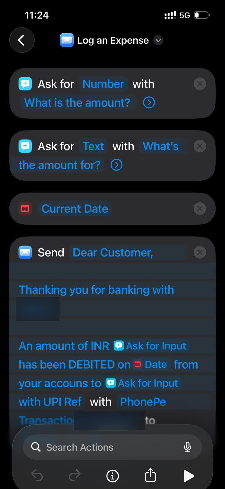
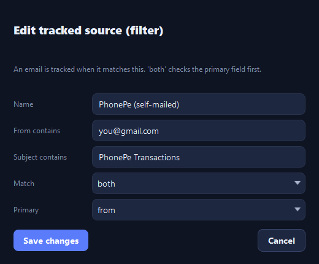
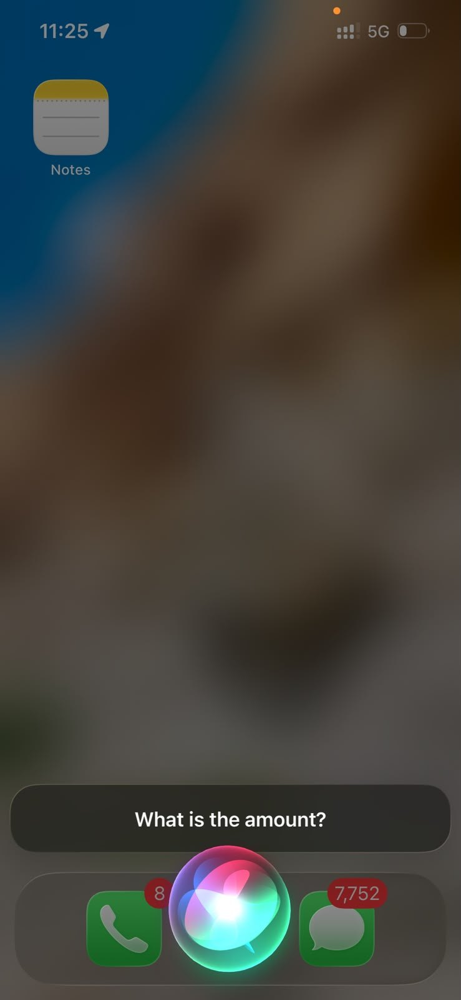
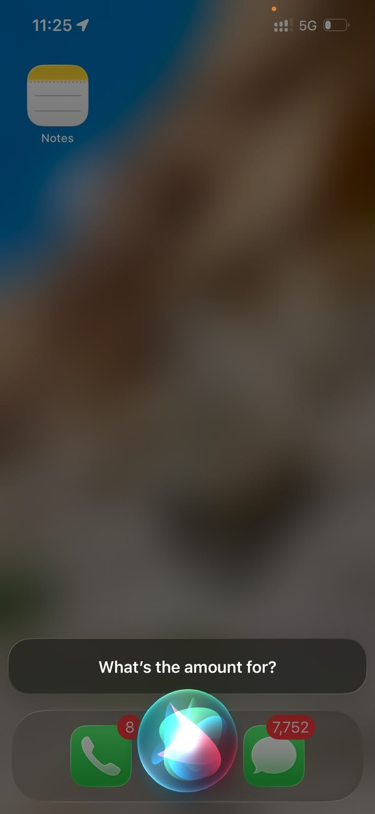
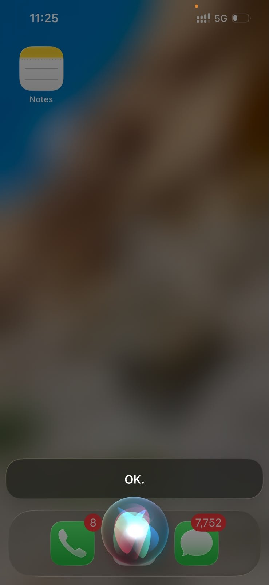
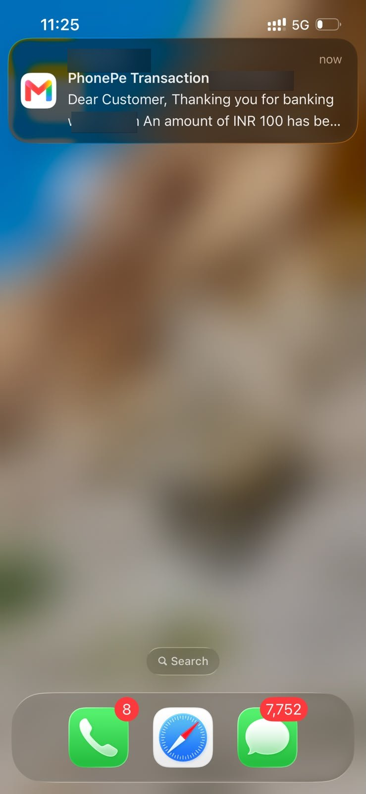

# Log expenses by voice — Apple Shortcut + Siri

WhoAteMySalary reads **transaction-alert emails**. That gives you a neat trick on iPhone /
iPad / Mac: build a little **Apple Shortcut** that emails *yourself* a bank-style alert, and
the app will pick it up and file it like any real transaction. Now you can log a cash or UPI
expense **hands-free with Siri**:

> "Hey Siri, **Log an Expense**." → *"What is the amount?"* → "250" → *"What's it for?"* →
> "Chai and samosa" → 🧌 the Money Goblin pops a notification and it lands in **Review**.

No extra app, no paid service — just Apple's built-in **Shortcuts** and **Mail**.

---

## How it works

The shortcut asks you for an amount and a note, then **sends an email to your own tracked
mailbox** whose body looks like a bank alert (it contains `INR <amount>` and the word
`DEBITED`). WhoAteMySalary already watches that mailbox, so its parser extracts the amount,
direction and merchant exactly as it would for a real bank email.

---

## 1. Build the "Log an Expense" shortcut

Open the **Shortcuts** app → **+** (new shortcut) → name it **Log an Expense**, then add these
actions in order:

| # | Action | Set it to |
|---|--------|-----------|
| 1 | **Ask for Input** | Input type **Number**, prompt **"What is the amount?"** |
| 2 | **Ask for Input** | Input type **Text**, prompt **"What's the amount for?"** |
| 3 | **Current Date** | (leave default) |
| 4 | **Send Email** | see below |

For the **Send Email** action:

- **To:** your own tracked address (the Gmail/Outlook WhoAteMySalary watches).
- **Subject:** `PhonePe Transactions` *(any text — it just has to match your filter in step 2)*.
- **Body:** paste the template below, inserting the two **Ask for Input** variables and the
  **Current Date** where shown.
- Turn **Show Compose Sheet → OFF** so Siri sends it silently.

**Body template** (the parts in **[brackets]** are inserted variables):

```
Dear Customer,

An amount of INR [Ask for Input — amount] has been DEBITED on [Current Date]
to [Ask for Input — what it's for] with UPI Ref via PhonePe.
```

> **Why this exact wording?** The parser needs two things to recognise a transaction:
> an amount written as **`INR <number>`** (or `Rs <number>`), and a direction keyword —
> **`DEBITED`** for money out, or **`CREDITED`** for money in. The merchant is taken from the
> **`to <…>`** part, so your spoken note becomes the payee. Keep those three and you can word
> the rest however you like.



*(Tip: duplicate the shortcut and swap `DEBITED` for `CREDITED` to make a "Log Income" one.)*

---

## 2. Tell WhoAteMySalary to track these emails

In the app: **Settings → Tracked sources → Add source** (or **Edit** an existing one) and match
the emails your shortcut sends — by **your own address** and/or the **subject** you chose:



- **From contains:** your email address (the one the shortcut sends *from* / *to*).
- **Subject contains:** `PhonePe Transactions` (or whatever subject you used).
- **Match:** `both` is safest once you've set a from + subject.

That's it — the next email from your shortcut will be tracked.

---

## 3. Run it with Siri

Just say **"Hey Siri, Log an Expense"** (the shortcut's name is the phrase). Siri walks you
through the two questions and sends the email:

<p>
  
  
  
</p>

Seconds later the alert lands in your inbox and WhoAteMySalary catches it (and the Money Goblin
lets you know):



Open the app's **Review** page to confirm the category — done.

---

## Tips

- **Income:** change `DEBITED` → `CREDITED` in the body for money-in entries.
- **Currency:** the template uses `INR`; change it (e.g. `USD`, `Rs`) to match how you think in
  money — see the app's **Parser** page for what's recognised.
- **Add to Home Screen / Back Tap:** in the Shortcuts app you can add "Log an Expense" to your
  Home Screen, a widget, or an iPhone **Back Tap** for one-tap logging without Siri.
- **Privacy:** the email only goes to *your own* mailbox; nothing leaves your accounts.
